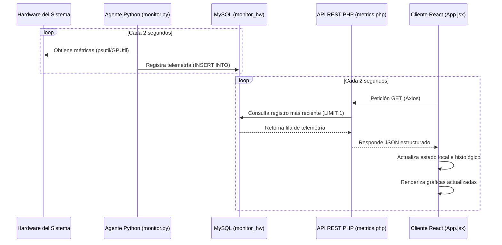

# Monitor de Rendimiento de Recursos del Sistema

Un sistema integral para el monitoreo en tiempo real de recursos críticos del hardware (CPU, memoria RAM, GPU, almacenamiento y red), con una interfaz de usuario en modo oscuro inspirada en el Administrador de Tareas de Windows.

## Arquitectura del Proyecto

El sistema se compone de tres capas principales:

1. **Agente de Adquisición (Python):** Script dedicado a recolectar métricas del sistema (uso e información de CPU, RAM, GPU, discos y red) de manera continua.
2. **Servidor API (PHP):** Endpoint REST que recibe, almacena e interactúa con la base de datos relacional para exponer los históricos y el estado en tiempo real en formato JSON.
3. **Cliente Web (React + Vite):** Panel visual responsivo y estilizado que renderiza los gráficos de rendimiento y permite consultar registros históricos.

---

## Plan de Desarrollo y Cronograma

A continuación se detalla la planificación y el estado del proyecto a lo largo de un ciclo de desarrollo de 9 días.

### Cronograma General

| Día | Fase de Desarrollo | Descripción de la Actividad | Estado |
| :--- | :--- | :--- | :---: |
| **Día 1** | Base de Datos | Configuración del entorno de base de datos relacional | Completado |
| **Día 2** | Agente de Monitoreo | Programación del script extractor en Python | Completado |
| **Día 3** | Backend API | Desarrollo del endpoint REST en PHP | Completado |
| **Día 4** | Frontend Setup | Maquetado inicial de la interfaz en React (Modo Oscuro) | Completado |
| **-** | Descanso | Pausa programada de fin de semana | - |
| **Día 5** | Integración de Gráficos | Implementación de minigráficas de rendimiento en tiempo real | Completado |
| **Día 6** | Métricas de E/S | Despliegue de métricas de almacenamiento y red | Pendiente |
| **Día 7** | Módulo de Históricos | Filtros y consultas por fecha en base de datos | Pendiente |
| **Día 8** | Optimización | Pruebas de carga, estrés y rendimiento general | Pendiente |
| **Día 9** | Despliegue | Cierre de documentación y despliegue final | Pendiente |

---

## Detalles de las Fases de Trabajo

### Fase 1: Configuración de Base de Datos (Día 1)
- [x] Crear y configurar la rama de trabajo principal (`feature/monitor-windows-ui`).
- [x] Adaptar el esquema relacional (`monitor_sistema.sql`) para admitir atributos de GPU (porcentaje de uso, temperatura).
- [x] Diseñar el modelo de datos para soportar el almacenamiento dinámico de múltiples discos físicos.

### Fase 2: Script Extractor de Datos (Día 2)
- [x] Programar la recolección periódica de métricas del hardware host mediante subprocesos y APIs del sistema operativo.
- [x] Investigar e implementar módulos de soporte para GPUs dedicadas (librerías `GPUtil` y `WMI`).

### Fase 3: API REST del Servidor (Día 3)
- [x] Implementar la API de PHP para encapsular las métricas consolidadas (CPU, RAM, Discos, Red y GPU).
- [x] Validar la serialización de respuestas a formato estándar JSON.
- http://localhost/sistema-monitor/Backend/api/metrics.php

### Fase 4: Maquetado del Frontend (Día 4)
- [x] Configurar el andamiaje del cliente web empleando Vite y React.
- [x] Diseñar la maquetación de la interfaz de usuario en modo oscuro con la disposición lateral de los componentes críticos.

> [!NOTE]
> **Fin de Semana (Días 5 y 6):** Pausa planificada para actividades de descanso.

### Fase 5: Conectividad y Gráficos (Día 5)
- [x] Conectar la interfaz web al backend PHP mediante consumo de la API REST.
- [x] Integrar librerías de gráficos (`Chart.js` o `Recharts`) para renderizar gráficos de líneas continuos y sin ejes, emulando la estética del Administrador de Tareas.

### Fase 6: Detalle de Almacenamiento y Conexiones (Día 6)
- [ ] Validar y formatear la visualización de la memoria en unidades físicas reales (GB utilizados / GB totales).
- [ ] Asegurar el cálculo dinámico del porcentaje de uso en los volúmenes de disco duro montados.

### Fase 7: Consulta de Históricos (Día 7)
- [ ] Desarrollar un filtro temporal interactivo (selector de fechas) para consultar estados anteriores de hardware almacenados en la base de datos.

### Fase 8: Pruebas de Estrés y Diagnóstico (Día 8)
- [ ] Someter el sistema a cargas elevadas de trabajo simuladas para comprobar la estabilidad de la recolección de datos.
- [ ] Garantizar la eficiencia del renderizado del frontend bajo frecuencias de actualización de datos de alta velocidad.

### Fase 9: Despliegue e Informe Final (Día 9)
- [ ] Consolidar los commits del código en la rama principal.
- [ ] Finalizar la documentación técnica del sistema en este archivo `README.md` y preparar la entrega.

---

## Detalles de cada archivo

A continuación se detalla el propósito, la estructura interna y la funcionalidad de cada uno de los archivos que integran el proyecto actualmente:

### 1. Base de Datos: [127_0_0_1.sql](../ServiceActivities/Adrian/Monitor/Backend/127_0_0_1.sql)
Este archivo contiene el script SQL para configurar e inicializar la base de datos relacional MySQL del sistema (`monitor_hw`). 

- **Estructura y Tablas:**
  - **`equipos`:** Almacena información básica de los dispositivos monitoreados. Campos: `id` (Clave Primaria), `nombre_pc`, `sistema_operativo` y `fecha_registro`. Posee un registro inicial para la computadora principal (`id = 1`).
  - **`metricas_rendimiento`:** Tabla principal que recopila de manera histórica los datos de telemetría de hardware enviados por el agente. Registra:
    - Uso de CPU en porcentaje (`uso_cpu`).
    - Uso de memoria RAM en porcentaje (`uso_ram`) y en cantidad absoluta de Gigabytes utilizados (`ram_gb_usados`).
    - Rendimiento gráfico en GPU: porcentaje de uso (`uso_gpu`) y temperatura en grados Celsius (`temp_gpu`).
    - Tasas de transferencia de red en kilobits por segundo: bajada (`red_bajada_kbps`) y subida (`red_subida_kbps`).
    - Información de almacenamiento estructurada (`info_discos`) en formato JSON, la cual almacena un mapeo dinámico de todas las unidades físicas y particiones detectadas junto con su porcentaje de ocupación individual.
    - Timestamp de registro (`registrado_en`).

---

### 2. Agente de Monitoreo: [monitor.py](../ServiceActivities/Adrian/Monitor/Backend/scripts/monitor.py)
Es un script ejecutable escrito en Python que actúa como demonio o servicio recolector en segundo plano. Se ejecuta de manera indefinida en la máquina objetivo para recopilar periódicamente métricas reales de hardware mediante APIs del sistema operativo.

- **Características y Módulos Clave:**
  - **`psutil`:** Utilizado para extraer estadísticas en tiempo real de la CPU, memoria RAM, discos montados y el tráfico por red.
  - **`GPUtil`:** Módulo para la detección y recopilación de métricas de rendimiento en tarjetas gráficas dedicadas NVIDIA.
  - **`mysql.connector`:** Interfaz nativa para establecer conexiones e insertar datos directamente en la base de datos local de MySQL.
- **Lógica de Ejecución:**
  - Se ejecuta en un bucle continuo configurado con intervalos de descanso de 2 segundos.
  - Calcula dinámicamente las tasas de velocidad de red (descarga y carga en KB/s) comparando los contadores del sistema respecto al tiempo transcurrido desde la última consulta.
  - Consulta y formatea todas las unidades de almacenamiento disponibles, convirtiendo la información a una cadena JSON limpia antes de guardarla.
  - Realiza un redondeo de precisión a 2 decimales para homogeneizar los datos recolectados y los inserta en la tabla `metricas_rendimiento`.

---

### 3. API REST del Servidor: [metrics.php](../ServiceActivities/Adrian/Monitor/Backend/api/metrics.php)
Es el backend escrito en PHP que sirve como interfaz o endpoint REST para exponer los datos estructurados en formato estándar JSON hacia el cliente web o frontend.

- **Características Clave:**
  - **Control de Acceso y CORS:** Define las cabeceras `Content-Type: application/json` y habilita solicitudes CORS de lectura (`Access-Control-Allow-Origin: *`, `Access-Control-Allow-Methods: GET`) para permitir peticiones seguras desde navegadores en cualquier origen.
  - **Consultas con PDO:** Emplea la interfaz PDO para conectarse de forma eficiente al gestor de bases de datos. Realiza una consulta directa para obtener únicamente la métrica más reciente (`ORDER BY id DESC LIMIT 1`).
  - **Manejo de Errores e Historiales Vacíos:** Estructura respuestas diferenciadas. Si la base de datos cuenta con registros, decodifica el objeto JSON de discos para integrarlo limpiamente en el JSON de respuesta. Si no hay datos, emite una advertencia controlada.
  - **Manejo de Excepciones:** Si ocurre un error de conexión, captura la excepción `PDOException`, actualiza el estado HTTP de respuesta a `500 Internal Server Error` y retorna un JSON descriptivo con el problema.

---

### 4. Documentación: [README.md](../ServiceActivities/Adrian/Monitor/README.md)
Es el archivo de documentación técnica actual. Detalla la arquitectura de tres capas del sistema, describe el plan de desarrollo desglosado en actividades, y profundiza en las funciones y conexiones de todos los componentes activos del proyecto.

---

### 5. Cliente Web (React): [App.jsx](../ServiceActivities/Adrian/Monitor/frontend/src/App.jsx)
Representa la interfaz gráfica de usuario en modo oscuro que interactúa con el backend de forma asíncrona.
- **Características Clave:**
  - **Estado Local y Hooks (`useState`, `useEffect`):** Almacena de manera local la última métrica de CPU y RAM (`currentData`), y mantiene un arreglo histórico de las últimas 20 lecturas (`cpuHistory`, `ramHistory`) para construir la visualización temporal de las gráficas.
  - **Visualización con Recharts:** Consume el componente `<LineChart>` y `<Line>` para renderizar gráficas de línea continua (tipo sparklines) para CPU y Memoria RAM, imitando los minigráficos del Administrador de Tareas.
  - **Actualización Continua:** Hace uso de `setInterval` para consultar asíncronamente el backend cada 2000 ms, y limpia el temporizador durante el desmontaje del componente para evitar fugas de memoria.

---

## Arquitectura de Conexiones y Flujo de Datos

El sistema opera bajo un flujo continuo e integrado de información estructurado en tres pasos clave:

1. **Adquisición e Inserción:** El agente extractor (`monitor.py`) en Python lee las estadísticas de hardware a través de llamadas de sistema (`psutil` y `GPUtil`), redondea la información y la inserta periódicamente cada 2 segundos en la base de datos MySQL local (`monitor_hw`).
2. **Exposición del Endpoint:** El servidor web Apache (alojado a través de XAMPP en el puerto `80`) sirve el backend en PHP (`metrics.php`), el cual consulta de forma optimizada el registro de telemetría más reciente mediante PDO y lo expone formateado como JSON, aplicando las políticas de CORS necesarias.
3. **Consumo y Renderizado:** El cliente React, que corre localmente mediante el servidor de desarrollo de Vite (puerto `5173`), consume asíncronamente este JSON en el endpoint de Apache (`http://localhost/sistema-monitor/Backend/api/metrics.php`), actualizando el estado del componente para redibujar la interfaz de usuario en tiempo real.

---

## Bitácora de Integración y Solución de Incidencias Técnicas

Durante la fase de integración de los tres componentes (Python + PHP + React), se detectaron y resolvieron diversos fallos críticos de conectividad y renderizado:

### 1. Corrección de la URL de API y Configuración de Apache
* **Problema:** El frontend intentaba realizar llamadas HTTP hacia el puerto alternativo `http://localhost:5000/api/metrics`. Dado que el servidor web local se ejecuta sobre el puerto por defecto de Apache (`80`) y la estructura del proyecto está enlazada mediante un *junction* en `C:\xampp\htdocs\sistema-monitor`, las peticiones fallaban con errores de red.
* **Solución:** Se corrigió el endpoint en el cliente React hacia la ruta absoluta correcta de Apache: `http://localhost/sistema-monitor/Backend/api/metrics.php`.

### 2. Homologación de Claves del JSON de Telemetría
* **Problema:** Existía una inconsistencia en las variables usadas en ambos extremos; el backend exponía las métricas bajo las claves `cpu_percent`, `ram_percent` y `ram_gb_usados`, mientras que el frontend intentaba desestructurarlas de forma incorrecta como `cpu_porcentaje`, `ram_porcentaje` y `ram_total_gb`, dejando los componentes gráficos en un estado de valores indeterminados (`undefined`).
* **Solución:** Se reestructuraron las llamadas en el componente asíncrono de React para mapear de manera estricta y correcta las propiedades proporcionadas por la API de PHP.

### 3. Ajuste de Renderizado de Recharts (ResponsiveContainer en Sparklines)
* **Problema:** En el diseño inicial, las gráficas pequeñas de la barra lateral estaban envueltas en un componente `<ResponsiveContainer>` de Recharts. Debido a que el contenedor padre (`.mini-graph-placeholder`) cuenta con un tamaño fijo y rígido de `60px` por `40px` y está anidado en un menú con estilos Flexbox, Recharts calculaba un tamaño inicial de ancho y alto equivalente a `0`, haciendo que la gráfica no se viese reflejada en la interfaz de usuario.
* **Solución:** Se removió el contenedor responsivo y se asignaron dimensiones fijas (`width={54}` y `height={34}`) directamente a la etiqueta `<LineChart>`, garantizando que el motor de renderizado de Recharts dibuje el SVG de forma estática e instantánea al montar la interfaz.

### 4. Depuración de Sintaxis en React
* **Problema:** Se identificaron errores sintácticos de JavaScript en el andamiaje del componente `App.jsx`, tales como:
  * El uso incorrecto de llaves de objetos `{}` en lugar de corchetes `[]` para la desestructuración del hook `useState` para `currentData`.
  * La falta de la estructura interna asíncrona dentro del hook `useEffect` al intentar llamar de forma síncrona a `axios` utilizando `await`.
  * Error ortográfico en el disparador del temporizador (`setIterval` en lugar de `setInterval`).
  * Declaración incompleta en la función de limpieza de la referencia del intervalo (`return (clearInterval(interval)`).
* **Solución:** Se corrigieron todas las inconsistencias de código, implementando la llamada asíncrona de manera encapsulada y retornando una función flecha limpia en el cleanup de React (`return () => clearInterval(interval);`).