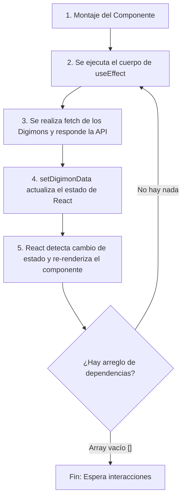

# useEffect + fetch en React: Concepto, Práctica y Análisis del Bucle Infinito

Este documento resume la teoría y los ejercicios prácticos de la integración de peticiones HTTP en componentes de React, tomando como base el proyecto de la **API de Digimon**.

---

## 1. Concepto: useEffect + fetch Juntos

En React, el renderizado de un componente debe ser una función pura. Sin embargo, en aplicaciones reales necesitamos realizar **efectos secundarios** (*side-effects*), como interactuar con APIs externas.

*   **`fetch`**: Es la herramienta nativa del navegador para hacer peticiones HTTP (promesas) y obtener recursos de un servidor.
*   **`useEffect`**: Es el Hook de React encargado de sincronizar nuestro componente con sistemas externos. Nos permite ejecutar código en momentos específicos del ciclo de vida del componente (ej. cuando se monta por primera vez).

Si ejecutamos `fetch` directamente en el cuerpo del componente, se llamaría en **cada renderizado**, lo cual saturaría el servidor y provocaría un bucle infinito al actualizar el estado. `useEffect` nos permite envolver esa llamada HTTP para controlar exactamente cuándo se ejecuta.

---

## 2. Práctica: Consumir una API Pública (Digimon API)

Para realizar una petición cuando el componente aparece en pantalla (montaje), llamamos a `fetch` dentro de `useEffect` y pasamos un **arreglo de dependencias vacío (`[]`)**. En el proyecto de Digimon, realizamos un recorrido del 1 al 11 para traer información de múltiples criaturas e ir agregándolas de forma secuencial al estado.

### Código de Ejemplo (Práctica - Digimon API)

```jsx
import { useState, useEffect } from 'react';
import { DigimonCards } from './components/DigimonCards';

function App() {
  const [digimonData, setDigimonData] = useState([]);
  const base_url = 'https://digi-api.com/api/v1/digimon';

  const fetchDigimon = async (id) => {
    try {
      const response = await fetch(`${base_url}/${id}`);
      const data = await response.json();
      // Guardamos la información en el estado de forma acumulativa
      setDigimonData((prevDigimonData) => [...prevDigimonData, data]);
    } catch (error) {
      console.error(error);
    }
  };

  useEffect(() => {
    // Al montar el componente, cargamos los primeros 11 Digimons
    for (let i = 1; i <= 11; i++) {
      fetchDigimon(i);
    }
  }, []); // <-- [] Arreglo vacío asegura que solo corra UNA vez al montar el componente

  return (
    <div className='px-4'>
      <div className='grid grid-cols-1 md:grid-cols-2 lg:grid-cols-3 gap-4'>
        {digimonData.map((digimon, index) => (
          <DigimonCards key={index} digimonData={digimon}/>
        ))}
      </div>
    </div>
  );
}
```

---

## 3. Análisis: ¿Cómo provocar un Bucle Infinito y por qué pasa?

El error del **bucle infinito (infinite loop)** ocurre cuando omitimos por completo el arreglo de dependencias en `useEffect` al actualizar el estado en su interior.

### Código Incorrecto (Provocador del Bucle)

```jsx
// ¡ERROR! Bucle infinito asegurado
useEffect(() => {
  for (let i = 1; i <= 11; i++) {
    fetchDigimon(i); // <-- setDigimonData actualiza el estado de React
  }
}); // <-- Sin el arreglo de dependencias []
```

### Explicación del Bucle Paso a Paso:



1.  **Montaje Inicial**: El componente se renderiza por primera vez.
2.  **Ejecución del Efecto**: Al no tener arreglo de dependencias, `useEffect` se ejecuta obligatoriamente en el montaje inicial.
3.  **Llamada a la API**: Se invocan las 11 llamadas a la API de Digimon.
4.  **Actualización del Estado**: `setDigimonData` updates the state with the new Digimons received.
5.  **Re-renderizado**: En React, **cualquier cambio en el estado fuerza un nuevo renderizado** del componente para actualizar la pantalla.
6.  **Re-ejecución del Efecto**: Como omitimos el arreglo de dependencias, React interpreta que este `useEffect` debe correr en **cada renderizado** subsiguiente.
7.  **Ciclo Infinito**:
    *   Se ejecuta el efecto de nuevo $\rightarrow$ se llaman a los fetches $\rightarrow$ se actualiza el estado con `setDigimonData` $\rightarrow$ se dispara otro render $\rightarrow$ se vuelve a ejecutar el efecto...
    *   Este ciclo se ejecuta de manera ininterrumpida y a gran velocidad, lo que termina **congelando la pestaña del navegador** debido a la sobrecarga del hilo de ejecución de JavaScript, y además podría causar que el servidor de la API te bloquee por exceso de peticiones.

### Cómo solucionarlo:
Siempre debemos añadir el arreglo de dependencias `[]` al final de `useEffect` si la intención es cargar los datos una única vez en el montaje inicial del componente.
